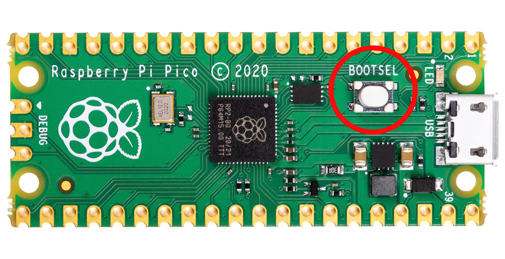

# **Pico-Duck**

**Pico-Duck** es un proyecto que concentra las instrucciones necesarias para convertir una **Raspberry Pi Pico** en un **HID (Human Interface Device)**.  

Un HID es cualquier dispositivo con el que una persona puede interactuar, como un teclado, un mouse o un control.  
En este caso, la Raspberry actuará como si presionara teclas reales, ejecutando acciones a partir de la lectura de un archivo de texto.

---

## **Instrucciones**

### **1. Configurar la Raspberry Pi Pico**

**1.1** Asegúrate de que tu Raspberry Pi Pico esté desconectada.  
Mantén presionado el botón **`BOOTSEL`**, y mientras lo mantienes presionado, **conéctala al puerto USB** de tu computadora.  

Esto pondrá la Pico en modo de carga y restablecerá sus valores iniciales.



---

### **2. Instalar CircuitPython**

**2.1** Ingresa a [CircuitPython.org/downloads](https://circuitpython.org/downloads) y busca tu modelo de Raspberry Pi Pico.  

**2.2** Descarga el archivo **`.UF2`** correspondiente a tu modelo.  

**2.3** Copia el archivo descargado dentro de la unidad **RPI-RP2** (que aparece al conectar la Pico).  
La Raspberry se reiniciará automáticamente y ahora aparecerá como **CIRCUITPY**.

---

### **3. Agregar la librería Adafruit HID**

**3.1** Dirígete a la sección de [librerías de CircuitPython](https://circuitpython.org/libraries) y busca el paquete **Bundle for Version 9.x**. Descarga el archivo **`.zip`**.

**3.2** Descomprime el archivo. Dentro de la ruta:
```
adafruit-circuitpython-bundle-9.x-mpy-20251014/lib
```
busca la carpeta llamada **`adafruit_hid`** y cópiala.

**3.3** En tu Raspberry (unidad **CIRCUITPY**), crea una carpeta llamada **`lib`**, y dentro de ella pega la carpeta **`adafruit_hid`**.

Tu estructura de archivos debería verse así:

```bash
CIRCUITPY/
 ├── boot_out.txt
 └── lib/
     └── adafruit_hid/
         ├── __init__.mpy
         ├── keyboard.mpy
         ├── mouse.mpy
         └── ...
```

---

### **4. Agregar el código principal en Python**

Ahora que la Pico ya tiene CircuitPython y las librerías necesarias, podemos cargar el código que interpretará y ejecutará las instrucciones.

**4.1** Descarga el archivo `code.py` ubicado dentro de la carpeta `/public` del repositorio.

**4.2** Copia el archivo `code.py` a la raíz de la unidad **CIRCUITPY**.

Tu estructura ahora debería verse así:

```bash
CIRCUITPY/
 ├── boot_out.txt
 ├── code.py
 └── lib/
     └── adafruit_hid/
         ├── __init__.mpy
         ├── keyboard.mpy
         ├── mouse.mpy
         └── ...
```

---

### **5. Crear el archivo de instrucciones**

Este archivo indicará qué debe hacer la Raspberry.  
El script en `code.py` leerá su contenido y ejecutará las acciones como si fueran pulsaciones reales del teclado.

#### 🧩 **Crear tu propia rutina**

Crea un archivo llamado **`juas.txt`** en la raíz de la unidad **CIRCUITPY**.  
Dentro de él puedes escribir los comandos que la Pico ejecutará:

| Comando | Descripción | Ejemplo |
|----------|--------------|----------|
| **STRING [texto]** | Escribe texto literal. | `STRING Hola, ¿cómo estás?` |
| **COMBO [teclas...]** | Ejecuta combinaciones de teclas. | `COMBO ALT F4` |
| **[TECLA ESPECIAL]** | Presiona una sola tecla. | `ENTER`, `TAB`, `ESC` |

📌 Ejemplo:
```
WINDOWS R
STRING cmd
ENTER
STRING Hola, ¿cómo estás?
ENTER
```

#### 🧪 **Usar ejemplos listos**

En la carpeta `/public/ex` del repositorio encontrarás algunos ejemplos listos para probar.  
Puedes descargar cualquiera, renombrarlo a `juas.txt` y copiarlo dentro de tu Raspberry.

**Ojo**  
 Una vez agregando el archivo este se ejecutara en tu computadora, te recomiendo agregarlo y desconectarlo antes de que este se empiece a ejecutar.

---

## ⚠️ Aviso

Este proyecto tiene fines **educativos y de aprendizaje**.  
El autor **no se hace responsable** del uso indebido del software o del código proporcionado.
